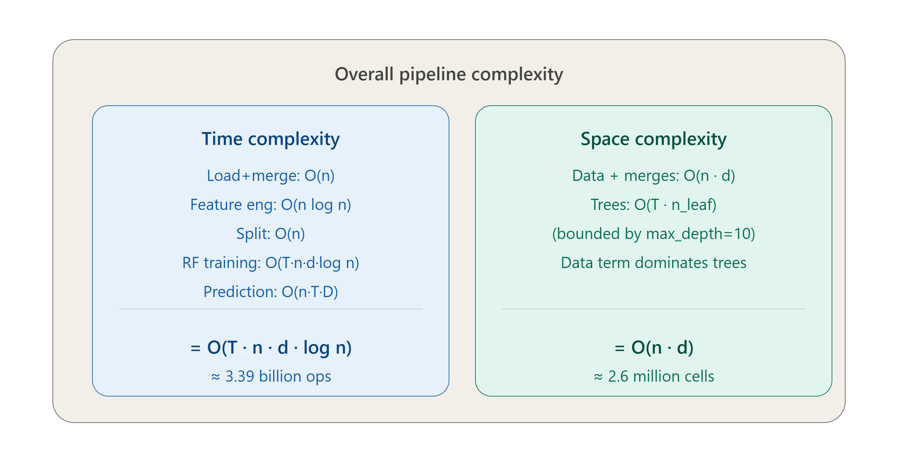

# Time & Space Complexity Analysis

**Project:** UPI Transaction Fraud Detection  
**Author:** Komal Swami | 24CRD02538

---

## Overall Pipeline Complexity



---

## Time Complexity Breakdown

| Pipeline Stage | Complexity | Description |
|---------------|------------|-------------|
| Load + Merge | O(n) | Reading 7 CSV files and merging on transaction_id |
| Feature Engineering | O(n log n) | Sorting, groupby aggregations, ratio calculations |
| Train/Test Split | O(n) | Random sampling of 1,00,000 rows |
| RF Training | O(T · n · d · log n) | T=100 trees, d=36 features, n=1,00,000 rows |
| Prediction | O(n · T · D) | D = max_depth=10 per tree |

### Overall Time Complexity
```
O(T · n · d · log n)
≈ 100 × 1,00,000 × 36 × 17
≈ 3.39 billion operations
```

> Dominant term: Random Forest training — O(T·n·d·log n)

---

## Space Complexity Breakdown

| Component | Complexity | Description |
|-----------|------------|-------------|
| Data + Merges | O(n · d) | n=1,00,000 rows × d=36 features |
| Trees (Forest) | O(T · n_leaf) | Bounded by max_depth=10 |
| Predictions | O(n) | Output array of n rows |

### Overall Space Complexity
```
O(n · d)
≈ 1,00,000 × 26
≈ 2.6 million cells
```

> Data term dominates trees (max_depth=10 keeps tree size bounded)

---

## Parameters Used

| Parameter | Value |
|-----------|-------|
| n (rows) | 1,00,000 |
| d (features) | 36 |
| T (trees) | 100 |
| max_depth | 10 |
| Train/Test split | 80/20 |

---

## Key Takeaway

- **Time:** O(T·n·d·log n) — scales with trees and features, manageable with bounded depth
- **Space:** O(n·d) — linear in data size, efficient for 1,00,000 rows
- **Bottleneck:** RF training is the most compute-intensive step (~3.39B ops)
- **Optimization:** `max_depth=10` keeps both time and space complexity bounded
